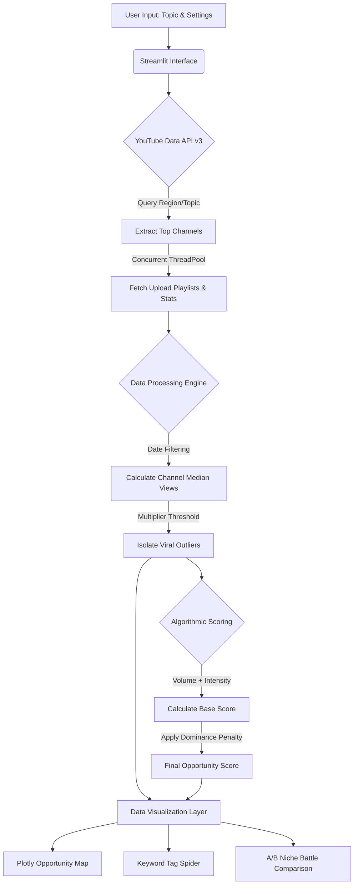

# ⚡ YouTube Market Intelligence Engine

An interactive, Python-based data product designed to analyze YouTube market saturation, detect viral outliers, and algorithmically score niche viability. Built with Streamlit, Pandas, and the YouTube Data API v3, this tool transforms raw video statistics into actionable market intelligence.

## 🚀 Overview

Content creators and digital marketers often rely on intuition to pick topics, leading to high failure rates in saturated markets. This project solves that problem by quantitatively measuring the "barrier to entry" for any given topic. By pulling real-time data and applying a custom weighted algorithm, the engine identifies "Gold Mines" (high-demand, low-supply niches) and warns against "Shark Tanks" (markets heavily dominated by massive incumbents).

## 🧠 Technical Highlights & Methodology

This project demonstrates a full-stack data science workflow, from data extraction to interactive visualization.

* **Asynchronous Data Engineering:** Utilizes Python's `concurrent.futures.ThreadPoolExecutor` to perform parallel API calls across multiple channels simultaneously, drastically reducing data ingestion latency.
* **Outlier Detection:** Rather than looking at raw views, the engine calculates a `Viral Multiplier`. It isolates videos performing statistically higher than their own channel's median baseline to identify true market demand independent of subscriber count.
    $$Viral\_Multiplier = \frac{Views_{Video}}{Median(Views_{Channel})}$$
* **Algorithmic Niche Scoring (0-100):** A custom mathematical model evaluates market viability based on three vectors:
    1.  **Market Depth:** Rewards topics with a high volume of identified outliers.
    2.  **Viral Intensity:** Rewards topics where the median multiplier of top videos is exceptionally high.
    3.  **Saturation Penalty:** Applies a weighted reduction factor if >50% of the market share is held by "Sharks" (channels with >1M subscribers).
* **Exploratory Data Analysis (EDA) UI:** Leverages `Plotly` to generate interactive scatter plots, categorical gauge charts, and keyword frequency horizontal bar charts for immediate visual insights.

## 📊 System Architecture


🛠️ Features & Usage
1. Deep Dive Dashboard (Single Niche)
Analyzes a specific keyword/topic and returns a comprehensive health check.

Gauge Chart: Visualizes the final 0-100 Niche Opportunity Score.

Opportunity Map: A multi-dimensional Plotly scatter plot mapping Upload Date vs. Viral Multiplier, sized by Total Views, and colored by Opportunity Classification.

Tag Spider: Extracts and aggregates hidden video tags to identify secondary long-tail keywords.

2. A/B Niche Battle (Comparative Analysis)
A head-to-head comparison engine allowing users to evaluate two distinct markets simultaneously.

Dynamically calculates differences in total market depth, median viral velocity, and "Shark Count."

Generates side-by-side grouped bar charts for instant comparative analysis.

💻 Installation
Prerequisites
Python 3.8+

A valid Google Cloud Platform API Key with the YouTube Data API v3 enabled.

Setup
Clone the repository:

Bash
git clone [https://github.com/yourusername/YT-Market-Intelligence-Engine.git](https://github.com/yourusername/YT-Market-Intelligence-Engine.git)
cd YT-Market-Intelligence-Engine

2. Install the required dependencies:
   ```bash
   pip install -r requirements.txt
Run the Streamlit application:

Bash
streamlit run app.py

4. Paste your API key into the secure sidebar input to begin analyzing data.

## 📸 Application Gallery

*(Insert screenshots of your application here)*

*   ``
*   ``
*   ``

## 📦 Dependencies
*   `streamlit`
*   `pandas`
*   `plotly`
*   `google-api-python-client`

